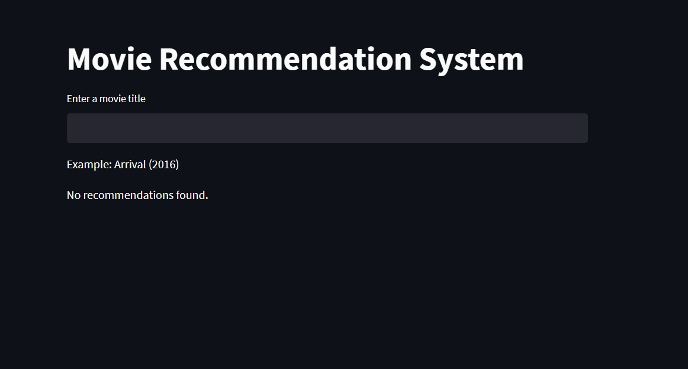
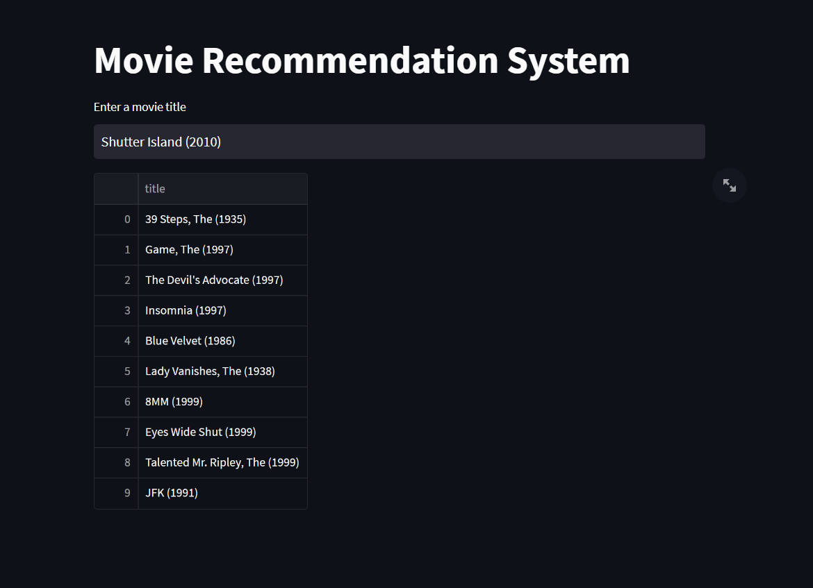

GenreGenius-Movie-Recommender
=======

Author: **[Moin Khan](https://github.com/mo-inkhan)**

GenreGenius-MovieRecommender is a user-friendly movie recommendation system that leverages the power of genre-based similarity to provide personalized movie suggestions. The recommendation system utilizes cosine similarity to find the similarity between movies and returns the top 10 most similar movies to the user. Built with Streamlit, this intuitive application presents users with the top 10 most similar films to their favorite titles, ensuring a delightful cinematic experience every time.

## Demo
[GenreGenius-MovieRecommender](https://mo-inkhan-genregenius-movie-recommender-app-jc7fhj.streamlit.app/)

## Usage

## Contributing
All contributions are welcome. Please create an issue first for any feature request or bug. Then fork the repository, create a branch and make any changes to fix the bug or add the feature and create a pull request. That's it!
Thanks!

## License
**GenreGenius-Movie-Recommender** is released under the MIT License.
Check out the full license [here](LICENSE).
